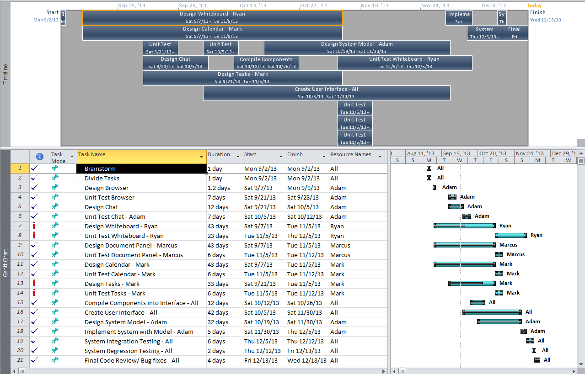
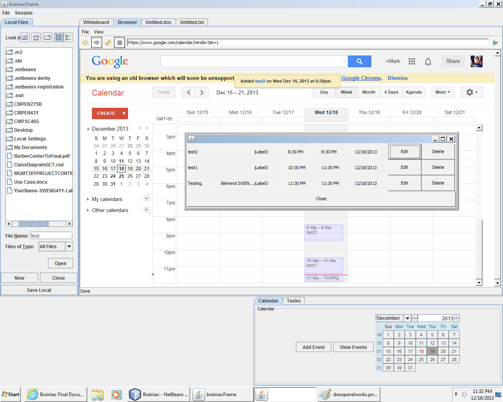

Brainiac
========

Brainiac is a class final project developed by Adam Bondi, Ryan Dewey, Mark Kiddo, and Marcus Tennant at Penn State in 2013.

Brainiac is an all in one team brainstorming and productivity suite, developed in java and javaDB and specifically making use of Object Oriented design principals with networking support.

Teams can connect to a host via tcp/ip and ftp to make use of a range of networked features. These include a whiteboard, chat, and document sharing/storing. 

Also included in the project is; A web browser to seamlessly search for new ideas. A task calendar integrating Google Calender api's to send team updates and deadlines straight to member's email and smartphones. PDF support. And it comes itegrated with OpenOffice.org to handle any document editing the team may need.

Inital Project planning

Task Updating

Editing Remote Documents

Chat and Calendar

